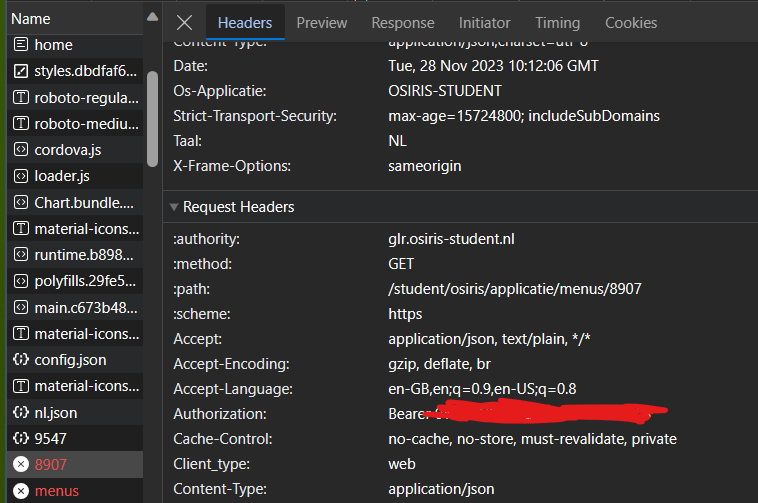

# osiris-glr
API wrapper for osiris (in Grafisch Lyceum Rotterdam)

## Features
* Fetching personalia (personal information).
* Fetching agenda.
* More to come.

## Installation 
The library can be installed through npm
```
npm i osiris-glr
```

## How to get authentication token
The beaner authentication token can easily be found in the osiris portal.
Simply copy the token without the "Beaner" part into your code.



## Quick start 
More examples can be found in the examples folder.

```
const osiris_glr = require("osiris-glr");
const client = new osiris_glr("TOKEN");

(async () => {
    const profile = await client.getPersonalia();
    console.log(`Logged in as ${profile.name}`)
})()
```